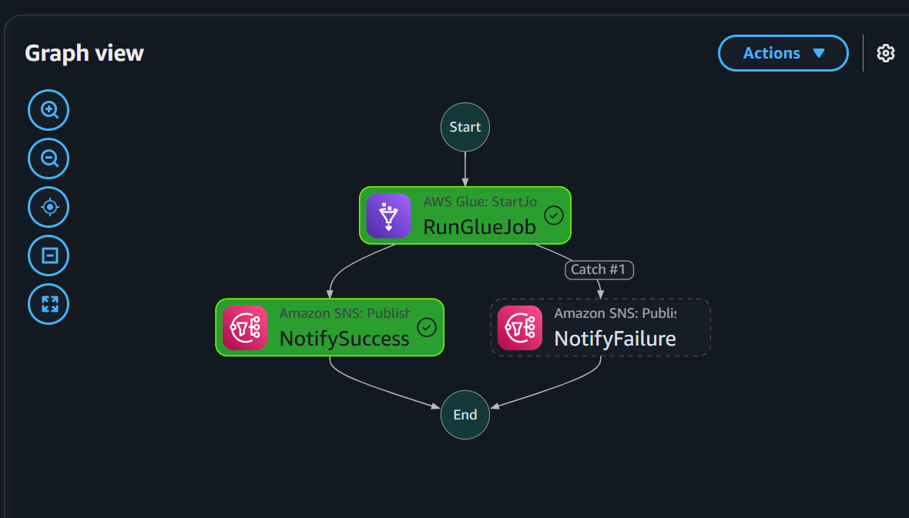
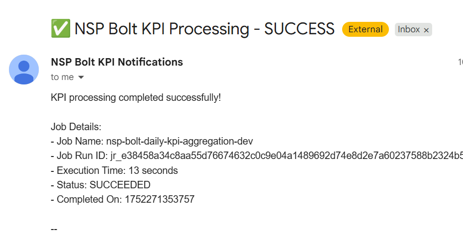

# NSP Bolt Ride - Real-Time Trip Processing Pipeline

**A scalable, event-driven data processing system for ride-hailing trip analytics using AWS services.**

## Project Overview

NSP Bolt Ride is a production-ready, real-time trip data ingestion and analytics pipeline designed for ride-hailing companies. The system processes trip start and end events from mobile applications, intelligently handles out-of-order data arrival, and generates daily KPI metrics for business intelligence.


### Problems Solved

1. **Event Ordering Challenges**: Trip start and end events arrive independently and may be out of order
2. **Data Quality Assurance**: Validates all incoming data and archives invalid records for analysis
3. **State Management**: Tracks trip completion status and triggers downstream processing
4. **Operational Resilience**: Handles failures gracefully with dead letter queues and retry mechanisms
5. **Analytics Readiness**: Generates daily KPIs in analytics-friendly formats

## Features

### Core Data Processing
- **Real-time Event Ingestion**: Processes trip start/end events via Amazon Kinesis Data Streams
- **Intelligent Trip Matching**: Combines trip start and end events regardless of arrival order
- **Atomic State Management**: Uses DynamoDB conditional updates to prevent race conditions
- **TTL-based Cleanup**: Automatically expires incomplete trips after 24 hours

### Data Validation & Quality
- **Comprehensive Schema Validation**: Enforces strict data schemas for trip_start and trip_end events
- **Business Rule Enforcement**: Validates datetime formats, fare ranges, and location constraints
- **Invalid Data Archival**: Archives rejected records to S3 with detailed error metadata
- **Data Quality Metrics**: Tracks validation errors and data quality trends

### Error Handling & Resilience
- **Categorized Error Handling**: Classifies errors into validation, transient, system, and poison pill categories
- **Dead Letter Queue Integration**: Routes failed records for retry or manual investigation
- **Poison Pill Detection**: Isolates problematic records to prevent stream blocking
- **Correlation ID Tracking**: Enables end-to-end traceability for debugging

### Analytics & Monitoring
- **Daily KPI Computation**: Generates total_fare, count_trips, average_fare, max_fare, min_fare
- **S3 Data Lake Storage**: Stores KPIs with date partitioning for efficient querying
- **Workflow Orchestration**: Uses Step Functions for reliable batch processing
- **SNS Notifications**: Sends success/failure alerts for operational monitoring

### DevOps & Automation
- **CI/CD Pipeline**: Automated testing and deployment via GitHub Actions
- **Feature Branch Workflow**: Supports parallel development with automated quality gates
- **Infrastructure as Code**: Declarative AWS resource management
- **Environment Isolation**: Separate development and production environments

## Architecture


### Data Flow Architecture

1. **Ingestion Layer**: Kinesis Data Streams with automatic partitioning
2. **Processing Layer**: Lambda functions with comprehensive validation
3. **Storage Layer**: DynamoDB for trip state, S3 for analytics and archives
4. **Orchestration Layer**: Step Functions for workflow management
5. **Notification Layer**: SNS for operational alerts

## Tech Stack

### Backend Services
- **AWS Lambda**: Serverless compute for stream processing and business logic
- **Amazon Kinesis Data Streams**: Real-time data ingestion and streaming
- **AWS Glue**: Managed ETL service for daily KPI computation
- **AWS Step Functions**: Workflow orchestration and error handling

### Databases & Storage
- **Amazon DynamoDB**: NoSQL database for trip state management
- **Amazon S3**: Data lake for KPI metrics and invalid data archives
- **Amazon SQS**: Dead letter queues for failed record handling

### Infrastructure & DevOps
- **AWS EventBridge**: Scheduled triggers for batch processing
- **Amazon SNS**: Notification service for operational alerts
- **AWS IAM**: Identity and access management with least privilege
- **GitHub Actions**: CI/CD pipeline with automated testing and deployment

### Development Tools
- **Python 3.9**: Primary programming language
- **Boto3**: AWS SDK for Python
- **Pandas**: Data manipulation for CSV processing
- **Pytest**: Unit testing framework with coverage reporting
- **Black & Flake8**: Code formatting and linting tools

### Monitoring & Observability
- **Amazon CloudWatch**: Metrics, logs, and alarms
- **AWS X-Ray**: Distributed tracing (configurable)
- **Custom Metrics**: Data quality and processing performance tracking

## Setup Instructions

### Prerequisites
- **AWS Account** with appropriate permissions
- **Python 3.9+** installed locally
- **Git** for version control
- **AWS CLI** configured with credentials

### 1. Clone Repository
```bash
git clone https://github.com/your-username/nsp-bolt-ride.git
cd nsp-bolt-ride
```

### 2. Install Dependencies
```bash
# Create virtual environment
python -m venv venv
source venv/bin/activate  # On Windows: venv\Scripts\activate

# Install dependencies
pip install -r requirements.txt
```

### 3. Configure Environment
```bash
# Copy environment template
cp config/dev.json.template config/dev.json

# Edit configuration with your AWS resources
# Update the following in config/dev.json:
# - dynamodb_table: your-dynamodb-table-name
# - kinesis_stream: your-kinesis-stream-name
# - s3_bucket: your-s3-bucket-name
```

### 4. Set Up AWS Resources
```bash
# Create DynamoDB table
aws dynamodb create-table \
  --table-name nsp-bolt-trips-dev \
  --attribute-definitions AttributeName=trip_id,AttributeType=S \
  --key-schema AttributeName=trip_id,KeyType=HASH \
  --billing-mode PAY_PER_REQUEST

# Create Kinesis stream
aws kinesis create-stream \
  --stream-name nsp-bolt-events-dev \
  --shard-count 1

# Create S3 buckets
aws s3 mb s3://nsp-bolt-analytics-dev-$(aws sts get-caller-identity --query Account --output text)
aws s3 mb s3://nsp-bolt-invalid-data-dev-$(aws sts get-caller-identity --query Account --output text)
```

### 5. Run Locally
```bash
# Test data generator
python src/utils/csv_trip_generator.py \
  --stream nsp-bolt-events-dev \
  --trip-start-csv data/trip_start.csv \
  --trip-end-csv data/trip_end.csv \
  --mode stream

# Run unit tests
pytest tests/unit/ -v --cov=src
```

## Data Flow / Pipeline Description

### Real-Time Processing Pipeline

1. **Event Generation**: Mobile apps or CSV generator sends trip events to Kinesis
2. **Stream Processing**: Lambda function processes events with validation
3. **State Management**: DynamoDB stores trip state and tracks completion
4. **Error Handling**: Invalid data archived to S3, failed records sent to DLQ
5. **Completion Detection**: Trips marked complete when both start/end events received

### Batch Analytics Pipeline

1. **Scheduled Trigger**: EventBridge triggers Step Function daily at 11:59 PM
2. **Workflow Orchestration**: Step Function manages Glue job execution
3. **Data Processing**: Glue job scans DynamoDB for completed trips
4. **KPI Computation**: Calculates daily metrics (total_fare, count_trips, etc.)
5. **Storage**: Results stored in S3 with date partitioning
6. **Notification**: SNS sends success/failure alerts





### Data Validation Flow

```
Incoming Event → Schema Validation → Business Rules → Type Conversion
       ↓                ↓                ↓               ↓
   Valid Event    Invalid Schema   Rule Violation   Type Error
       ↓                ↓                ↓               ↓
  Process Event   Archive to S3    Archive to S3   Archive to S3
       ↓
  Update DynamoDB → Check Completion → Trigger Analytics
```

## Usage Guide

### Starting the Pipeline

1. **Deploy Infrastructure**: Follow deployment instructions below
2. **Generate Test Data**: Use the CSV generator to send sample events
3. **Monitor Processing**: Check CloudWatch logs for real-time processing
4. **Verify Storage**: Confirm trip data appears in DynamoDB
5. **Trigger Analytics**: Wait for scheduled run or trigger manually

### Monitoring the System

```bash
# Check Lambda function logs
aws logs tail /aws/lambda/nsp-bolt-stream-processor-dev --follow

# Monitor Kinesis stream
aws kinesis describe-stream --stream-name nsp-bolt-events-dev

# Check DynamoDB item count
aws dynamodb scan --table-name nsp-bolt-trips-dev --select COUNT

# View S3 KPI outputs
aws s3 ls s3://nsp-bolt-analytics-dev/kpi_metrics/ --recursive
```

### Data Generation Examples

```bash
# Generate realistic streaming data
python src/utils/csv_trip_generator.py \
  --stream nsp-bolt-events-dev \
  --trip-start-csv trip_start.csv \
  --trip-end-csv trip_end.csv \
  --mode stream \
  --delay-min 1.0 \
  --delay-max 5.0

# Generate burst traffic for testing
python src/utils/csv_trip_generator.py \
  --stream nsp-bolt-events-dev \
  --trip-start-csv trip_start.csv \
  --trip-end-csv trip_end.csv \
  --mode burst \
  --burst-size 100 \
  --burst-delay 10
```

### Manual KPI Processing

```bash
# Trigger Step Function manually
aws stepfunctions start-execution \
  --state-machine-arn arn:aws:states:us-east-1:ACCOUNT:stateMachine:nsp-bolt-kpi-workflow-dev \
  --input '{}'

# Run Glue job directly
aws glue start-job-run \
  --job-name nsp-bolt-daily-kpi-aggregation-dev \
  --arguments '{
    "--dynamodb_table_name": "nsp-bolt-trips-dev",
    "--s3_output_bucket": "nsp-bolt-analytics-dev",
    "--target_date": "2024-05-25"
  }'
```

## Deployment Instructions

### CI/CD Pipeline Setup

1. **Configure GitHub Secrets**:
   ```
   AWS_ACCESS_KEY_ID_DEV
   AWS_SECRET_ACCESS_KEY_DEV
   AWS_ACCESS_KEY_ID_PROD
   AWS_SECRET_ACCESS_KEY_PROD
   AWS_ACCOUNT_ID
   ```

2. **Feature Development Workflow**:
   ```bash
   # Create feature branch
   git checkout develop
   git checkout -b feature/your-feature-name
   
   # Develop and commit changes
   git add .
   git commit -m "feat: your feature description"
   git push origin feature/your-feature-name
   
   # Create pull request to develop
   # CI tests run automatically
   # Merge triggers dev deployment
   ```

3. **Production Deployment**:
   ```bash
   # Merge develop to main for production
   git checkout main
   git merge develop
   git push origin main
   # Triggers automatic production deployment
   ```

### Manual Deployment Steps

1. **Create AWS Resources**:
   - DynamoDB tables (dev/prod)
   - Kinesis streams (dev/prod)
   - S3 buckets (analytics, invalid data, Glue scripts)
   - Lambda functions with proper IAM roles
   - Step Functions with SNS integration

2. **Deploy Lambda Functions**:
   ```bash
   # Package and deploy stream processor
   cd src/lambda/stream_processor
   zip -r ../../../stream_processor.zip .
   aws lambda update-function-code \
     --function-name nsp-bolt-stream-processor-prod \
     --zip-file fileb://stream_processor.zip
   ```

3. **Configure Monitoring**:
   - CloudWatch alarms for function errors
   - SNS topics for operational alerts
   - Custom metrics for data quality tracking

### Environment Configuration

- **Development**: Isolated resources with relaxed monitoring
- **Production**: High availability with comprehensive monitoring and alerting
- **Feature Branches**: CI testing only, no resource deployment

## Tests

### Running Tests

```bash
# Run all tests with coverage
pytest tests/ -v --cov=src --cov-report=html --cov-report=term

# Run unit tests only
pytest tests/unit/ -v

# Run integration tests
pytest tests/integration/ -v

# Run specific test file
pytest tests/unit/test_stream_processor.py -v
```

### Test Coverage

- **Unit Tests**: 85%+ coverage for core business logic
- **Integration Tests**: End-to-end pipeline validation
- **Mock Testing**: AWS service interactions with moto library
- **Data Validation Tests**: Schema and business rule validation

### CI/CD Testing Pipeline

```yaml
# GitHub Actions automatically runs:
1. Code formatting check (Black)
2. Linting analysis (Flake8)
3. Unit tests with coverage reporting
4. Integration tests in isolated environment
5. Security scanning (Bandit)
6. Dependency vulnerability checks
```

### Test Categories

- **Stream Processing Tests**: Kinesis event handling and DynamoDB updates
- **Validation Tests**: Schema enforcement and business rule validation
- **Error Handling Tests**: DLQ integration and error categorization
- **KPI Computation Tests**: Glue job logic and S3 output validation
- **End-to-End Tests**: Complete pipeline from event ingestion to KPI generation

### Performance Testing

```bash
# Load testing with burst traffic
python tests/performance/load_test.py \
  --stream nsp-bolt-events-dev \
  --events-per-second 100 \
  --duration-minutes 10

# Validate processing latency
python tests/performance/latency_test.py \
  --stream nsp-bolt-events-dev \
  --sample-size 1000
```

## Contributing

1. Fork the repository
2. Create a feature branch from `develop`
3. Make your changes with appropriate tests
4. Ensure all CI checks pass
5. Submit a pull request to `develop`

